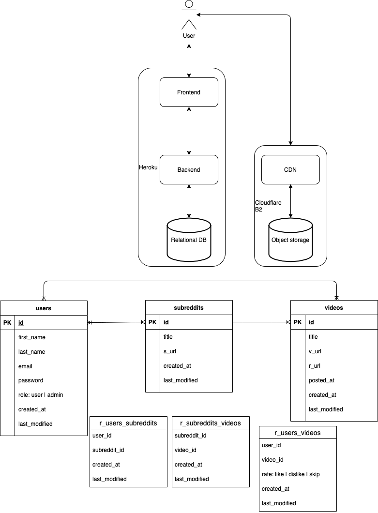

# Reddit Short Videos

## System Design



## Frontend

Please run the following commands **AT FRONTEND DIRECTORY**.

```sh
(frontend)$ npm install # install dependencies
(frontend)$ npm run dev # running react with json-server for development
```

### json-server

[json-server](https://github.com/typicode/json-server) hosts fake REST API and you can requests CRUD operations such as GET, POST, PUT, and DELETE.

- [http://localhost:5000/users](http://localhost:5000/users)
- [http://localhost:5000/subreddits](http://localhost:5000/subreddits)
- [http://localhost:5000/videos](http://localhost:5000/videos)
